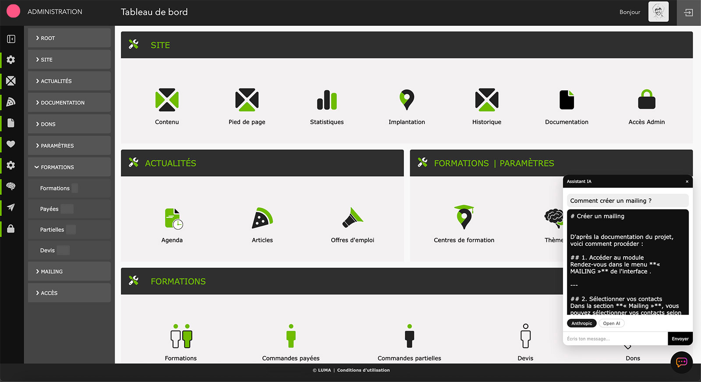
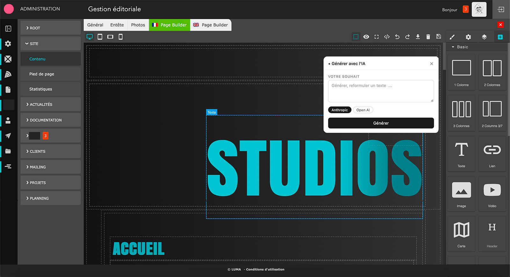

# Luma — Plateforme CMS/CRM base PHP

> Projet personnel développé depuis 2010 — présenté ici comme base technique, sans prétention commerciale.

---

## À propos

Luma est une plateforme que je développe en continu depuis 2010 pour mes propres besoins et ceux de clients directs.

Ce projet est le fruit d'un **parcours entièrement autodidacte** en développement web. Sans formation informatique initiale — ma formation de base étant la réalisation audiovisuelle et le graphisme — j'ai appris PHP, la POO, SQL, JavaScript et l'architecture logicielle par la pratique, sur le terrain, projet après projet depuis 2003.

Luma n'est pas un framework concurrent de Laravel ou Symfony. C'est une **base applicative sur mesure**, construite brique par brique, qui me sert de socle pour déployer rapidement des outils de gestion d'entreprise adaptés à des contextes spécifiques — là où les solutions du marché sont souvent trop génériques, trop lourdes ou trop chères.

Le code présenté ici est une **version épurée** du projet réel. Les données, configurations et éléments propres aux clients sont retirés.

---

## À propos de l'auteur

Graphiste et motion designer de formation (ESRA Sup'Infograph, 2000–2003), développeur autodidacte depuis 2003, chef de projet MOE pendant 7 ans — j'ai construit ce CRM en parallèle de mon activité professionnelle, par nécessité et par passion.

Ce parcours atypique m'a donné une compréhension concrète des secteurs pour lesquels je développe : retail haut de gamme, audiovisuel, médias, communication visuelle. Mes outils sont construits par quelqu'un qui connaît les métiers de ses clients.

Depuis 2024, je me spécialise en **Prompt Engineering et intégration IA**, en greffant sur ce socle des modules LLM, RAG et embeddings vectoriels.

---

## Ce que c'est concrètement

Un socle PHP modulaire qui embarque nativement :

- Un **CMS multi-pages** avec builder visuel (GrapesJS) — édition drag & drop, header/footer indépendants, gestion des menus
- Un **gestionnaire de contenu** — articles, galeries photos, galeries vidéo, cartes, formulaires de contact
- Un **système d'administration** multi-niveaux — root, owner, utilisateurs, sessions sécurisées
- Un **module IA intégré** — agent conversationnel, mémoire de session, base de connaissance RAG, embeddings vectoriels
- Des **outils transverses** — upload de fichiers, gestion d'images, captcha, envoi d'e-mails (PHPMailer), sitemap XML, cache GZIP

---

## Architecture multi-sites et multilingue

C'est la fonctionnalité structurante de la plateforme.

**Une seule installation, un nombre illimité de sites.**

Chaque site est cloisonné — données, contenu, utilisateurs, configuration — tout est isolé. Les sites partagent le même système de fichiers et la même base de code, mais ne se voient pas entre eux.

```
Plateforme Luma (une seule installation)
│
├── Site A — France         (fr / en)
├── Site B — Belgique       (fr / nl)
├── Site C — Espagne        (es / en)
├── Site D — Intranet RH    (fr)
└── Site N — ...            (langues au choix)
```

**Cas d'usage typiques :**

- **Groupe international** — un site par pays, même plateforme, administration centralisée
- **Groupe national** — un site par région ou enseigne, gestion cloisonnée
- **Site mère + microsites** — site corporate + sites de marques ou filiales
- **Multi-marques** — plusieurs entités distinctes sur une infrastructure commune

**Ce que le cloisonnement garantit :**

| Élément | Isolation |
|---|---|
| Contenu (pages, articles, médias) | ✓ Par site |
| Utilisateurs et droits | ✓ Par site |
| Configuration et paramètres | ✓ Par site |
| Base de connaissance IA | ✓ Par site |
| Langue(s) disponibles | ✓ Par site |
| Système de fichiers | Partagé — optimisation des ressources |

**Multilingue natif** — chaque site peut exposer son contenu en plusieurs langues. La gestion des traductions est intégrée à l'interface d'administration, sans plugin tiers.

---

## Stack technique

| Couche | Technologie |
|---|---|
| Backend | PHP 8 · POO · Namespaces · `strict_types` · PDO |
| Base de données | MySQL / MariaDB |
| Frontend | Vanilla JS · AJAX · CSS modulaire |
| Builder | GrapesJS (éditeur de pages visuel) |
| IA | API Anthropic Claude · API OpenAI · Embeddings vectoriels |
| Email | PHPMailer (Composer) |
| Déploiement | Apache · `.htaccess` · wizard d'installation |

---

## Architecture des classes

```
includes/class/
│
├── Agent/                        — Module IA
│   ├── AiAgentManager.php        Orchestrateur : mémoire + knowledge + LLM
│   ├── AiKnowledgeManager.php    RAG : recherche vectorielle + fallback FULLTEXT
│   ├── AiMemoryManager.php       Historique de conversation par session
│   ├── EmbeddingsManager.php     Génération de vecteurs + similarité cosinus
│   ├── OpenAiClientManager.php   Client multi-provider (Anthropic / OpenAI)
│   └── CmsManager.php            Interface IA ↔ pages GrapesJS
│
├── front/                        — Rendu front-end
│   ├── PageManager.php           Routing et rendu des pages
│   ├── NavManager.php            Navigation et menus
│   ├── PostManager.php           Articles et actualités
│   ├── PhotoManager.php          Galeries photos
│   ├── VideoManager.php          Galeries vidéo
│   ├── ContactManager.php        Formulaires et contacts
│   ├── LocationManager.php       Cartes et localisations
│   └── LangManager.php           Multi-langue (FR / EN)
│
├── tools/                        — Utilitaires
│   ├── PDOManager.php            PDO étendu : tracking requêtes + timing
│   ├── SecureManager.php         Sécurité : CSRF, sanitize, hashing
│   ├── FileUploadManager.php     Upload sécurisé multi-formats
│   ├── ImageTools.php            Redimensionnement et traitement image
│   └── ImgManager.php            Gestion des chemins et versions d'images
│
├── session/
│   └── SessionManager.php        Sessions BDD : HMAC, rotation, binding IP
│
└── xml/
    └── XmlManager.php            Sitemap XML + flux RSS
```

---

## Le module IA en détail

L'agent conversationnel repose sur une architecture RAG (Retrieval Augmented Generation) :

```
Message utilisateur
        ↓
AiMemoryManager     — charge l'historique de la session (15 derniers échanges)
        ↓
AiKnowledgeManager  — recherche les documents pertinents
                      → vectoriel (embeddings cosinus) si disponible
                      → FULLTEXT MySQL en fallback
        ↓
OpenAiClientManager — construit le prompt enrichi et appelle l'API
                      → Anthropic Claude  (claude-sonnet-4-6)
                      → OpenAI GPT-4      (gpt-4.1-mini)
        ↓
Réponse ancrée dans la base de connaissance
```

Le module est également connecté au CMS : une interface dans GrapesJS permet de générer du contenu directement dans les zones de texte des pages via un prompt utilisateur.

---

## Ce que ce socle permet de construire

Selon les besoins d'un client, ce socle peut devenir en quelques semaines :

- Un **outil de gestion interne** (suivi de projets, planning, ressources, formations, facturation, cotations, mailing)
- Un **assistant IA métier** entraîné sur les documents de l'entreprise
- Un **portail client** avec espaces personnalisés et contenu dynamique
- Un **outil de reporting** connecté à une base de données existante
- Une **solution de gestion de contenu** pour des agences ou indépendants

---

## Applications augmentées par l'IA — intéressé ?

Si vous êtes une entreprise ou une structure qui cherche à **intégrer l'IA dans vos outils métiers** sans partir de zéro, ce socle peut servir de base.

Je peux déployer des solutions sur mesure qui combinent :

- **Prompt Engineering** adapté à votre secteur et vos données
- **Base de connaissance RAG** alimentée par vos documents internes
- **Assistant conversationnel** intégré à votre interface existante
- **Génération de contenu** automatisée pour vos équipes

Mon profil hybride — développeur autodidacte PHP/JS depuis 25 ans, créatif (motion design, retail, audiovisuel), chef de projet — me permet d'intervenir à toutes les étapes : de la définition du besoin au déploiement.

**Contact : github@lumaprod.com**
**Portfolio : github.com/pcd-ai-dev**
**LinkedIn : linkedin.com/in/pierre-cosmao-dumanoir**

---

## Extraits de code

Les fichiers dans `/src` de ce repo sont des **extraits illustratifs** — signatures de classes et méthodes publiques commentées, sans implémentation complète ni données sensibles.

Le code de production complet est disponible sur demande dans le cadre d'un entretien ou d'une discussion projet.

---

## Screenshots

### Interface d'administration


### Builder de pages (GrapesJS)


### Outil de gestion de formation


### Outil de gestion de projets (Client / Projet / ressources)


---

*Luma — Pierre Cosmao-Dumanoir · 2003–2026 · Paris*